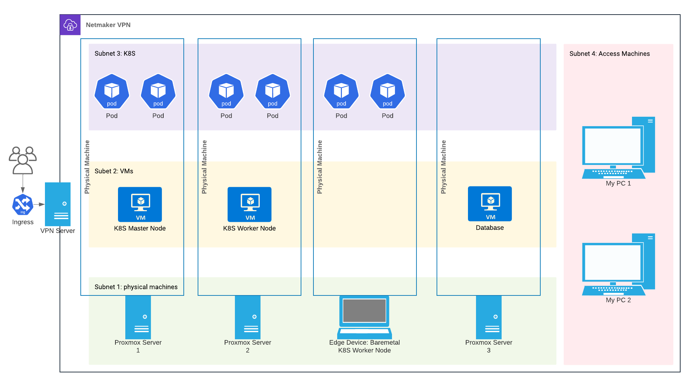
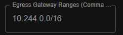

## Distributed K8S Cluster

There are a lot of challenges to making a distributed K8S cluster where nodes are located in multiple physical networks. These include:

* Allowing nodes to access eachother (VPN)
* Configuring the nodes as worker / master nodes
* Ensuring nodes use the correct (VPN) IP addresses
* Configuring a network plugin that works over the VPN
* Enabling LoadBalancers and Ingress 
* Exposing services to the Internet, and dealing with ingress / egress points to the cluster
* Managing machine outages without physical access

To solve these problems, this project creates a series of Terraform resources and Ansible playbooks which configure a distributed K8S cluster. To understand how we got to this technology stack and why we selected it, read our [Tech Overview](./TechOverview.md).

# How it works

### Requirements

To create the cluster, you need:

1. A dedicated machine on a cloud provider (AWS EC2, DigitalOcean Droplet) with a static ip at at least one vCPU and 1 GB of RAM.
2. At least one physical machine with Proxmox installed
3. Any number of physical edge devices
4. A control machine with Terraform and Ansible installed. Additionally, it needs SSH access to all the physical devices, API access to the Proxmox machines, and network access to the cloud machine.

The cloud machine hosts a [Netmaker VPN](https://www.netmaker.org/). This builds on top of wireguard to create virtual subnets, and provides explicit support for K8S network CNIs. The physical Proxmox machines will host VMs that will in turn become K8S nodes. This is the recomended way to run K8S nodes on sufficiently powerful hardware, because if the nodes networks break for whatever reason you can reboot it remotely without physical access. It enables you to develop your infrastructure on one set of VMs while running production code in another set. finally, it also makes common operations such as backups and restoring much simpler. 

However, when K8S nodes are run baremetal, problems that break networking require physical access to fix. The physical edge devices will run K8S nodes baremetal. This is recomended for devices that have insufficient computational power to run VMs, such as Raspberry Pis. Finally, the control machine will be what provisions the entire cluster.

### Network Architecture

The diagram below shows the final network architecutre:



The cloud machine runs the Netmaker VPN and provides ingress. Physical machines are placed on their own subnet, VMs on another, K8S nodes on yet another, and finally access machines are on a fourth subnet. Each proxmox server can run multiple VMs.

Note that Netmaker is a mesh solution, which is not shown in the diagram. No DNS server is needed because Netmaker directly edits the `hosts` file of each machine.

Each physical machine and VM will run an SSH server to provide remote access. 

# Getting Started

This project is intended to be added as a submodule to some other repository. This repository would contain customizations and configuration information for your specific cluster, allowing you to have infrastructure as code. This comes with many posible benefits such as version control, code review, and automated deployments. However, this project can also be used directly by editing the files as you desire.

## Netmaker Setup

Follow [these instructions](https://docs.netmaker.org/quick-start.html) to set up your netmaker machine. This should be the cloud device hosted on an external provider. 

After this is set up, create two networks: one for the Proxmox machines, and one for the VMs. **Make sure these networks do not have the '.' character in their names, or it may break provisioning scripts.** For each network, create an access token. Especially for the VM network, make sure the number of uses on the access token is sufficiently high that you won't run out, as this token will be used to automatically provision VMs. We suggust turning UDP hole punching on for these networks, as without this there may be connection problems -- especially for the VM network.

## Proxmox Setup

We installed Proxmox 7.2. Make sure to update the apt repository at `/etc/apt/sources.list.d/pve-enterprise.list` by commenting out the `deb https://enterprise.proxmox.com/debian/pve bullseye pve-enterprise` line. Then add the no-subscription repository with 

```bash
echo deb http://download.proxmox.com/debian/pve bullseye pve-no-subscription > /etc/apt/sources.list.d/pve-no-subscription.list
```

Make sure the Proxmox machine has a valid hosts file. Importatly, ensure `ping localhost` works. If it doesn't, add an entry for `localhost` to the `/etc/hosts` file.

Ensure each machine has a useful hostname, as this will become an addressable name on the Netmaker VPN. **Make sure these hosts do not have the '.' character in their names, or it may break provisioning scripts.** You can change it with `hostnamectl set-hostname {name-here}`. Before seting up the VPN, install wireguard libraries with `apt install wireguard-dkms`. This ensures `netclient` has all the software it needs without it overwriting libraries Proxmox needs. Then add the hypervisor to the VPN on the appropriate network by following [these instructions](https://docs.netmaker.org/netclient.html).

## Create a master node

### Create a VM template

Before creating a master node, we need to create a template on Proxmox. This template will have VPN already configured, as well as a lot of necesarry provisioning to run Kubernetes. Additionally, using a template means that spining up a new VM takes seconds insteads of ~10 minutes. To create the template:

0. Add this project as a submodule:
```bash
git submodule add https://github.com/CalvinKrist/DistributedK8SCluster.git DistributedK8SCluster
```

1. Clone this repository on a machine with SSH access to newly created VMs. In order to provision the template, we use Ansible playbooks which require SSH access to the VM before VPN is setup. The Proxmox machine should always work, as well as any machine on the same LAN as the Proxmox server. Alternatively, you can add this as a submodule to an existing repository.

2. [Install Packer](https://learn.hashicorp.com/tutorials/packer/get-started-install-cli). This allows us to create the template from an ISO. 

3. Install Ansible

```bash
apt update
apt install ansible
```

3. Run the `./get-packer-plugins.sh` script to get the necesarry proxmox plugins.

4. Install the Debian ISO on your Proxmox node. We use the [Debian 11.3.0-amd-64 image](https://cdimage.debian.org/debian-cd/current/amd64/iso-cd/debian-11.3.0-amd64-netinst.iso).

5. Copy the example variables and edit them to suit your needs:

```bash
cp DistributedK8SCluster/create_template/example-variables.json ./my-variables.json
```

Your file structure would then look like:
```
my-repo:
  DistributedK8SCluster:
    create_template:
      example-variables.json
      make_template.py
  my-variables.json
```

6. If you want to customize the installation, ie to have your own scripts add additional features to the template, make a bash script with your customizations.

```
my-repo:
  DistributedK8SCluster:
    create_template:
      example-variables.json
      make_template.py
  my-variables.json
  my-customizations.sh
```

7. Create the template. The customizations argument is optional.

```bash
python3 DistributedK8SCluster/create_template/make_template.py var-file=my-variables.json customization=my-customizations.sh
```

The python script is a thin wrapper around Packer. It dynamically generates a JSON config for Packer. This is because conditional logic cannot be expressed in JSON.

**Note**: the VM ID of the template is set at a constant high value because Terraform tries to clubber the template when adding nodes.

### Create the first master node

Ensure you are on a machine with access to the Proxmox API and has Terraform + Ansible installed. Then make a new folder for your cluster and add the first Terraform module:

```
mkdir cluster
cp k8s-template.tf cluster/master-node-1.tf
```

Then edit `cluster/master-node-1.tf`. Change the values of the local variables so they are correct to your cluster. In particular, ensure `playbook` is the following:

```
playbook = "first-master-node.yml"
```

The variable `ansible_playbook_dir` controls the location of the ansible playbook directory relative to your `.tf` file. The default value assumes a directory strucrture like

```
DistributedK8SCluster/
  cluster/
    master-node-1.tf
  playbooks/
```

However, your Terraform modules could be located somewhere else. For example, if `DistributedK8SCluster` is installed as a submodule in another repo, your file system might look like this:

```
MyCluster/
  modules/
    master-node-1.tf
  DistributedK8SCluster/
    playbooks/
```

then you should change the `ansible_playbook_dir` variable so the module knows where to find the playbooks:

```
variable "ansible_playbook_dir" {
  type    = string
  default = "../DistributedK8SCluster/playbooks"
}
```

Then rename the two resources to have unique, meaningful names:

```
resource "proxmox_vm_qemu" "k8s_master_1" {
    ...
}

resource "local_file" "make_inventory_file_1" {
    ...
}
```

It's then time to create the node with:

```bash
cd cluster
terraform init
terraform apply -auto-approve
```

This will create a Kubernetes master node with a new control plane.

We then need to add this node as an egress point to the pod network. Otherwise, pods on different nodes won't be able to access eachother, and services with external IPs won't be externally accessable. Ensure that in Netmaker, the egress gateway range for the VM looks like the following:



You will need to do this for all nodes added to the K8S network.

### Create more master nodes

The process of adding new master nodes to the control plane is different than to create the first master node.

## Create a worker node (VM)

## Create a worker node (edge device)

## Ingress

## Working notes

### Setup notes


- will need to set worker node ips on startup... perhaps in the `/etc/sysconfig/kubelet` file after we connect to netmaker. See [this](https://stackoverflow.com/questions/54942488/how-to-change-the-internal-ip-of-kubernetes-worker-nodes)


mark a node as egress so other machines can talk to pods / services, bind egress to flannel iface
